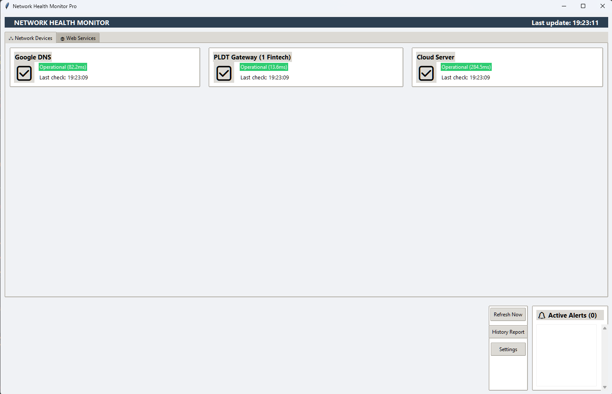
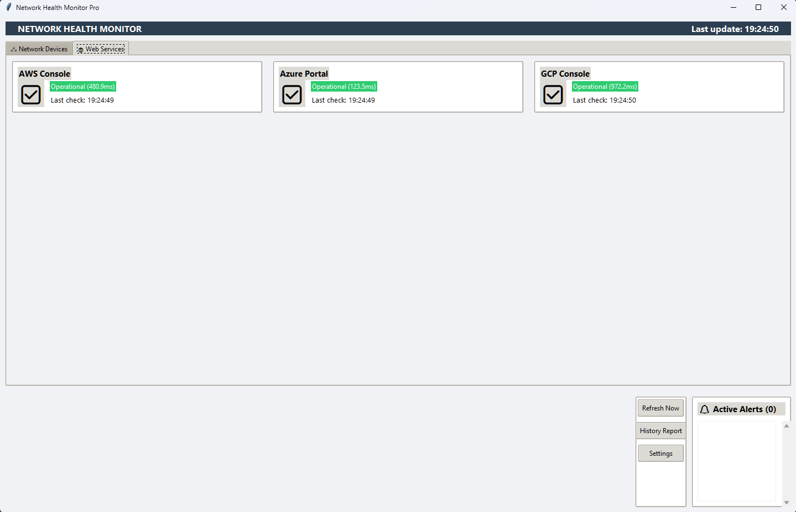

# Network Health Monitor Pro

This repository contains a Python-based GUI application for monitoring the status of network devices and web services using ICMP ping and HTTP requests. The application provides real-time monitoring, alerting, and logging for network administrators.

## Description

The `Ping_Monitoring.py` script is now a full-featured **Network Health Monitor Pro** application with the following features:

- **Real-time Monitoring:** Continuously monitors the status of network devices and web services.
- **GUI Interface:** Built with `tkinter` for a user-friendly experience.
- **Dynamic Configuration:** Uses a `config.json` file to manage IP addresses and web services.
- **Alert System:** Provides visual and console alerts for service outages or performance degradation.
- **Logging:** Automatically logs monitoring results to a file for historical analysis.
- **Customizable:** Easily add or remove devices and services via the `config.json` file.

## Requirements

### Python

- Python 3.x

### External Libraries

- [`ping3`](https://pypi.org/project/ping3/) (for ICMP ping functionality)
- [`requests`](https://pypi.org/project/requests/) (for HTTP requests to web services)
- [`validators`](https://pypi.org/project/validators/) (for URL validation)

### Standard Libraries

- `os`
- `json`
- `tkinter`
- `datetime`
- `threading`

## Installation

1. **Clone this repository to your local machine:**

    ```bash
    git clone https://github.com/yourusername/PingMonitoring.git
    cd PingMonitoring
    ```

2. **Install Python 3.x** if not already installed. Download it from [python.org](https://www.python.org/).

3. **Install required libraries:**

    ```bash
    pip install ping3 requests validators
    ```

4. **Create a `config.json` file** in the project directory with the following structure:

    ```json
    {
        "ip_addresses": {
            "Google DNS": "8.8.8.8",
            "PLDT Gateway": "58.69.0.89",
            "Cloud Server": "157.197.66.126"
        },
        "web_services": {
            "AWS Console": "https://aws.amazon.com",
            "Azure Portal": "https://portal.azure.com",
            "GCP Console": "https://console.cloud.google.com"
        },
        "alert_threshold": 200
    }
    ```

## Usage

1. **Run the application:**

    ```bash
    python Ping_Monitoring.py
    ```

## Application Features

- **Network Devices Tab:** Displays the status of IP addresses (ping results).
- **Web Services Tab:** Shows the status of web services (HTTP response times).
- **Alert Panel:** Lists active alerts for service outages or performance issues.
- **Control Panel:** Provides buttons for manual refresh, history reports, and settings.

### Customize Monitoring

- **Edit the `config.json` file** to add or remove devices and services.
- **Adjust the `alert_threshold`** value to change the response time threshold for alerts.

### Logs

- Monitoring logs are saved to `monitor.log` in the project directory.

### Screenshot

  


## Contributing

Contributions are welcome! Please follow these steps:

1. **Fork this repository.**

2. **Create a new branch** for your feature or bug fix:

    ```bash
    git checkout -b feature/your-feature-name
    ```

3. **Commit your changes:**

    ```bash
    git commit -m "Add your message here"
    ```

4. **Push to the branch:**

    ```bash
    git push origin feature/your-feature-name
    ```

5. **Submit a pull request.**

## License

This project is licensed under the MIT License - see the [LICENSE](LICENSE) file for details.

## What We Did Today

- **Upgraded the Script:** Transformed the basic ping monitoring script into a full GUI application.
- **Added Web Service Monitoring:** Included HTTP request functionality to monitor web services.
- **Dynamic Configuration:** Implemented a `config.json` file for easy customization of devices and services.
- **Improved UI/UX:** Designed a professional and user-friendly interface using `tkinter`.
- **Added Logging:** Implemented log file generation for historical monitoring data.
- **Enhanced Error Handling:** Added robust error handling for configuration and monitoring tasks.